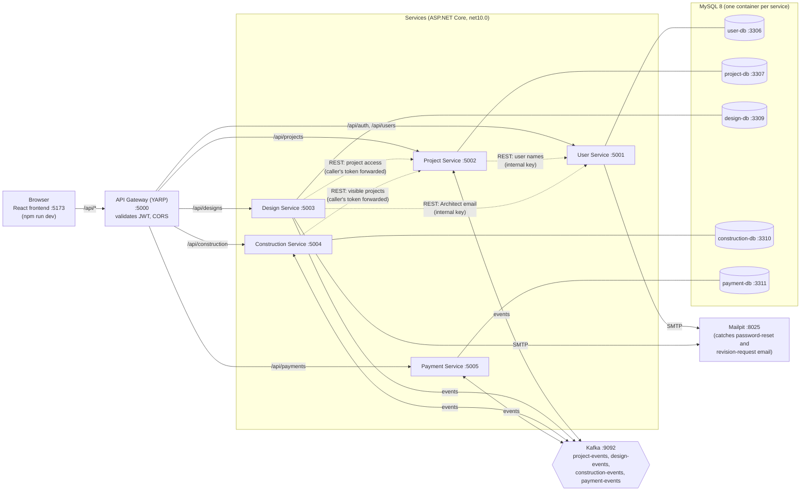
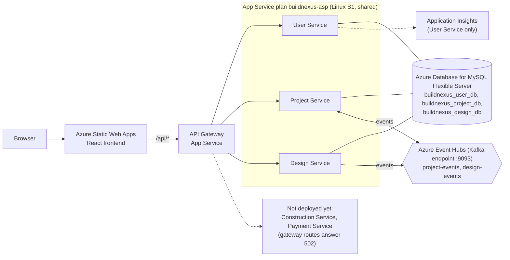

# Architecture

BuildNexus is five .NET services behind one YARP gateway, a React frontend, and
Kafka for the events services send each other. Each service owns its own MySQL
schema; nothing reads another service's database.

There are two pictures below because the system runs in two places and they are
not identical. **Local** is the full system. **Azure** is what is deployed today,
and it is smaller: Construction Service and Payment Service are not deployed yet.

## Local stack (`infra/docker-compose.yml`)

Everything runs. The frontend is the one piece outside compose: it runs with
`npm run dev` on port 5173 and proxies `/api` to the gateway.

Solid arrows are the main request path and Kafka traffic; dotted arrows are
service-to-service REST calls. The User Service is REST-only: it never touches Kafka.

## Azure (what is deployed today)

Region `southeastasia`, resource group `buildnexus-rg`. See
[infra/RUNBOOK.md](../infra/RUNBOOK.md) for names, settings and how it is
provisioned.

Differences from the local stack, so nobody is surprised:

- **No Construction or Payment Service.** The gateway has no address configured
  for them, so `/api/construction/*` and `/api/payments/*` answer `502`. As a
  result no `construction-events` or `payment-events` Event Hub exists either.
- **One shared MySQL server**, with one database per service (each with its own
  scoped user, except User Service, which still connects as the administrator).
  Locally it is five separate containers. The rule is the same either way: a
  service only connects to its own database.
- **Event Hubs instead of Kafka.** Services speak the Kafka protocol to Event
  Hubs' Kafka endpoint over SASL/TLS, so the code is the same; only
  `Kafka__BootstrapServers` and the SASL settings differ.
- **Swagger is off** (`ASPNETCORE_ENVIRONMENT=Production`) and so are the
  Development-only Admin seeder and Mailpit. Password-reset and revision-request
  email goes to the log stream rather than to a mail server.
- **Frontend on Azure Static Web Apps**, built with `VITE_GATEWAY_URL` pointing
  at the deployed gateway. Locally the Vite dev server does the proxying instead.

## Request path and auth

1. The browser calls the gateway only. It never calls a service directly.
2. The gateway validates the JWT's signature, issuer, audience and expiry before
   proxying, and answers CORS for the frontend origin. It makes no
   authorization decision.
3. The token is forwarded unchanged. Every service validates it again and
   enforces its own role rules (`Client`, `Architect`, `ProjectManager`,
   `Admin`), so a request that skipped the gateway would still be refused.
4. `/api/auth/*` is the only route open without a token. `/health` is open on the
   gateway and on every service.

| Path prefix | Service | Role of the service |
|---|---|---|
| `/api/auth/*`, `/api/users/*` | User Service | Registration, login, JWT issuing, user directory and admin user management |
| `/api/projects/*` | Project Service | Project lifecycle, team assignment, notifications, platform oversight, project report |
| `/api/designs/*` | Design Service | Design document upload, versioning, review and approval |
| `/api/construction/*` | Construction Service | Milestones, construction phase, progress for the Client, construction report |
| `/api/payments/*` | Payment Service | Quotations, invoices, client payments and history, payment report |

## Events

One Kafka topic per publishing service; every message uses the same envelope,
`{ "eventType", "eventId", "occurredAt", "payload" }`. Services write events to
an outbox table in the same transaction as the change and a dispatcher publishes
them, so a crash cannot lose an event or publish one for a change that rolled back.

| Topic | Published by | Events | Read by |
|---|---|---|---|
| `project-events` | Project Service | `ProjectCreated`, `ProjectUpdated`, `ProjectApproved` | Construction Service and Payment Service (`ProjectCreated`: record which Client owns the project) |
| `design-events` | Design Service | `DesignSubmitted`, `DesignRevisionRequested`, `DesignApproved` | Construction Service (`DesignApproved`: create the project's milestone-setup placeholder); Project Service notifications |
| `construction-events` | Construction Service | `ConstructionStarted`, `ConstructionCompleted`, `MilestoneCompleted` | Project Service (`ConstructionStarted` / `ConstructionCompleted` move the project's status; notifications); Payment Service (`ConstructionStarted`: raise the construction invoice) |
| `payment-events` | Payment Service | `PaymentReceived`, `FinalPaymentSettled`, `InvoiceGenerated` | Project Service (`PaymentReceived`: payment status; notifications); Construction Service (`FinalPaymentSettled`: unlocks handover) |

A consumer ignores event types it does not act on, so adding an event to a topic
does not break existing readers.

## Where each piece lives

| Piece | Folder |
|---|---|
| Services | `services/user-service`, `project-service`, `design-service`, `construction-service`, `payment-service` |
| Gateway | `api-gateway` |
| Frontend | `frontend` |
| Docker stack, Terraform, JMeter plan | `infra` |
| Tests | `services/*-tests`, `api-gateway-tests`, and `*.test.ts(x)` beside the frontend code |
